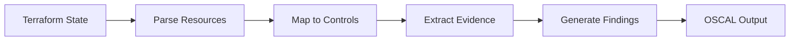

## Overview

NIST Special Publication 800-171 Revision 3 provides requirements for protecting Controlled Unclassified Information (CUI) when it resides in nonfederal systems and organizations. This framework is critical for government contractors and organizations that handle sensitive federal information.

Nabla's automated assessment analyzes your infrastructure-as-code to evaluate compliance against the 110+ security requirements in NIST 800-171 Rev 3.

## Framework Details

- **Framework**: NIST 800-171
- **Version**: Revision 3
- **Control Count**: 110+ requirements across 14 families
- **Output Format**: OSCAL Assessment Results (JSON)
- **Primary Use Case**: CUI protection, government contracting (DFARS compliance)

## Assessed Control Families

### 3.1 Access Control

| Control | Title | Assessment Method |
|---------|-------|-------------------|
| 3.1.1 | Limit system access to authorized users | Detects IAM users, roles, RBAC resources |
| 3.1.2 | Limit access to types of transactions | Evaluates IAM policies and access controls |
| 3.1.3 | Control CUI flow | Analyzes network segmentation and security groups |
| 3.1.5 | Employ least privilege | Identifies wildcard permissions in policies |
| 3.1.12 | Monitor remote access sessions | Detects VPN gateways and remote access controls |
| 3.1.13 | Cryptographic mechanisms for remote access | Verifies TLS/encryption for remote connections |
| 3.1.14 | Route remote access via managed access control points | Checks for VPN/bastion architectures |
| 3.1.20 | External system connections | Identifies VPC peering, transit gateways |

### 3.3 Audit and Accountability

| Control | Title | Assessment Method |
|---------|-------|-------------------|
| 3.3.1 | Create and retain system audit logs | Detects CloudTrail, CloudWatch, diagnostic settings |
| 3.3.2 | Alert on audit logging process failure | Identifies CloudWatch alarms, monitoring alerts |
| 3.3.4 | Review and update logged events | Verifies configurable audit mechanisms |

### 3.4 Configuration Management

| Control | Title | Assessment Method |
|---------|-------|-------------------|
| 3.4.1 | Establish baseline configurations | Infrastructure-as-code represents versioned baselines |
| 3.4.2 | Enforce security configuration settings | Detects version-controlled configuration |
| 3.4.6 | Employ least functionality | Identifies unnecessary exposed services/ports |
| 3.4.7 | Restrict network access | Evaluates security groups and firewall rules |

### 3.5 Identification and Authentication

| Control | Title | Assessment Method |
|---------|-------|-------------------|
| 3.5.1 | Identify system users | Detects IAM users, Azure AD, identity platforms |
| 3.5.2 | Authenticate users and devices | Analyzes authentication mechanisms |
| 3.5.3 | Use multifactor authentication | Verifies MFA requirements in Cognito, IAM policies |
| 3.5.7 | Prevent reuse of identifiers | Validates cloud IAM service enforcement |
| 3.5.10 | Store and transmit credentials securely | Detects Secrets Manager, Key Vault, Secret Manager |

### 3.11 Risk Assessment

| Control | Title | Assessment Method |
|---------|-------|-------------------|
| 3.11.1 | Conduct risk assessments | Organizational process (not fully assessable via IaC) |
| 3.11.2 | Scan for vulnerabilities | Detects AWS Inspector, Security Center, vulnerability scanning |

### 3.13 System and Communications Protection

| Control | Title | Assessment Method |
|---------|-------|-------------------|
| 3.13.1 | Monitor and control communications at boundaries | Identifies security groups, NACLs, firewalls, WAF |
| 3.13.5 | Implement subnetworks for public components | Verifies subnet separation |
| 3.13.8 | Cryptographic mechanisms for transmission | Detects HTTPS listeners, TLS configurations |
| 3.13.10 | Cryptographic key establishment and management | Analyzes KMS, Key Vault, key rotation |
| 3.13.11 | Employ FIPS-validated cryptography | Verifies use of FIPS 140-2 validated services |

### 3.14 System and Information Integrity

| Control | Title | Assessment Method |
|---------|-------|-------------------|
| 3.14.1 | Identify and manage system flaws | Organizational process (patch management) |
| 3.14.2 | Provide protection from malicious code | Detects GuardDuty and malware protection |
| 3.14.3 | Monitor system security alerts | Identifies SNS topics, monitoring alerts |
| 3.14.6 | Monitor organizational systems | Detects comprehensive logging and monitoring |
| 3.14.7 | Identify unauthorized use | Analyzes GuardDuty, Security Hub, threat detection |

## Multi-Cloud Support

<Note>
**Expanding Beyond AWS**: While our initial implementation focuses on AWS resources, we're actively adding support for:
- **Azure**: azurerm_* resources (Key Vault, RBAC, NSGs, Sentinel)
- **Google Cloud**: google_* resources (Cloud KMS, IAM, VPC, Security Command Center)
- **Multi-Cloud**: Unified compliance posture across hybrid environments

The NIST 800-171 assessor already includes detection for Azure and GCP resource types. Coverage will continue to expand based on customer needs.
</Note>

### Currently Supported Resource Types

**AWS Resources**
- `aws_iam_user`, `aws_iam_role`, `aws_iam_group`, `aws_iam_policy`
- `aws_security_group`, `aws_network_acl`, `aws_vpc`, `aws_subnet`
- `aws_cloudtrail`, `aws_cloudwatch_log_group`, `aws_cloudwatch_metric_alarm`
- `aws_kms_key`, `aws_kms_alias`
- `aws_s3_bucket` (with encryption checks)
- `aws_db_instance`, `aws_rds_cluster` (encryption at rest)
- `aws_vpn_gateway`, `aws_vpn_connection`, `aws_customer_gateway`
- `aws_cognito_user_pool`
- `aws_secretsmanager_secret`, `aws_ssm_parameter`
- `aws_guardduty_detector`, `aws_inspector_assessment_template`
- `aws_lb_listener`, `aws_alb_listener`

**Azure Resources** (Coming Soon!)
- `azurerm_role_assignment`, `azurerm_role_definition`
- `azurerm_network_security_group`, `azurerm_subnet`, `azurerm_firewall`
- `azurerm_monitor_diagnostic_setting`, `azurerm_monitor_metric_alert`
- `azurerm_key_vault`, `azurerm_key_vault_key`, `azurerm_key_vault_secret`
- `azurerm_active_directory_user`
- `azurerm_virtual_network_gateway`, `azurerm_virtual_network_peering`
- `azurerm_security_center_subscription_pricing`
- `azurerm_policy_definition`, `azurerm_policy_assignment`

## Assessment Workflow



## OSCAL Output Structure

Results conform to OSCAL 1.0.4 Assessment Results format:

```json
{
  "assessment-results": {
    "uuid": "assessment-uuid",
    "metadata": {
      "title": "Nabla NIST 800-171 Assessment",
      "version": "1.0.0",
      "oscal-version": "1.0.4"
    },
    "results": [{
      "uuid": "result-uuid",
      "title": "NIST 800-171 IaC Assessment",
      "description": "Automated assessment results from Terraform statefile analysis",
      "start": "2025-10-05T12:00:00Z",
      "end": "2025-10-05T12:05:00Z",
      "local-definitions": {
        "components": [...],
        "inventory-items": [...]
      },
      "observations": [
        {
          "uuid": "obs-uuid",
          "title": "3.1.1 Evidence",
          "description": "Identity resource: aws_iam_user.admin",
          "methods": ["TEST"],
          "subjects": [{
            "subject-id": "component-uuid",
            "type": "component"
          }],
          "props": [
            { "name": "control-id", "value": "3.1.1" },
            { "name": "status", "value": "satisfied" },
            { "name": "automated", "value": "true" }
          ]
        }
      ],
      "findings": [
        {
          "uuid": "finding-uuid",
          "title": "3.1.5 Finding",
          "description": "Overly permissive wildcard (*) found in policy",
          "target": {
            "target-id": "3.1.5",
            "type": "control"
          },
          "related-observations": [
            { "observation-uuid": "obs-uuid" }
          ]
        }
      ],
      "reviewed-controls": {
        "control-selections": [{
          "include-controls": [
            { "control-id": "3.1.1" },
            { "control-id": "3.1.2" }
          ],
          "source": {
            "href": "https://csrc.nist.gov/publications/detail/sp/800-171/rev-3/final"
          }
        }]
      }
    }]
  }
}
```

## Example Assessment Request

```bash
curl --request POST \
  --url https://api.usenabla.com/v1/cmmc \
  --header 'Content-Type: application/json' \
  --header 'X-Customer-Key: <x-customer-key>' \
  --data '{
  "name": "<string>",
  "format": "oscal",
  "source_type": "terraform_state",
  "source_content": "<string>",
}'
```

## Common Findings

### High-Severity Issues

**3.1.5 - Overly Permissive Policies**
```
Finding: "Overly permissive wildcard (*) found in AWS IAM Policy"
Remediation: Replace wildcards with specific resources and actions
```

**3.5.3 - Missing MFA**
```
Finding: "No multifactor authentication found in infrastructure"
Remediation: Enable MFA requirements in Cognito user pools or IAM policies
```

**3.13.11 - Non-FIPS Cryptography**
```
Finding: "No FIPS-validated cryptographic modules found"
Remediation: Use AWS KMS, Azure Key Vault, or GCP Cloud KMS
```

### Medium-Severity Issues

**3.3.1 - Insufficient Logging**
```
Finding: "No event logging mechanisms found"
Remediation: Enable CloudTrail, VPC Flow Logs, and application logging
```

**3.13.8 - Unencrypted Transmission**
```
Finding: "No cryptographic mechanisms found for data in transit"
Remediation: Configure HTTPS/TLS on load balancers and API endpoints
```

## DFARS Compliance

NIST 800-171 compliance is required for:
- Defense Federal Acquisition Regulation Supplement (DFARS) clause 252.204-7012
- Organizations that process, store, or transmit Controlled Unclassified Information (CUI)
- DoD contractors and subcontractors

This automated assessment helps demonstrate compliance with DFARS requirements, but should be supplemented with:
- System Security Plans (SSP)
- Plan of Action & Milestones (POA&M)
- Certification from C3PAO (Cyber AB)

## Limitations

<Warning>
**Important Assessment Limitations**:
- **IaC-Only**: Only evaluates resources defined in infrastructure code
- **Runtime Gaps**: Cannot assess operational security practices, user behavior, or physical security
- **Organizational Controls**: Many 800-171 requirements involve policies, procedures, and training
- **Partial Coverage**: Some controls (3.1.14, 3.11.1, 3.14.1) require organizational assessment
- **Cloud Provider Trust**: Assumes FIPS validation claims by AWS/Azure/GCP are accurate
</Warning>

## Best Practices

1. **Layered Assessment**: Combine automated IaC scanning with manual policy review
2. **Continuous Monitoring**: Run assessments on every infrastructure change
3. **Evidence Retention**: Store OSCAL outputs for audit trail and POA&M tracking
4. **Gap Analysis**: Use findings to prioritize remediation efforts
5. **Third-Party Validation**: Consider C3PAO assessment for official certification

## Scoring and POA&M

While Nabla provides automated control assessment, official NIST 800-171 scoring requires:
- Basic (0-9 points per control)
- Derived (additive scoring)
- Plan of Action & Milestones for deficiencies

Use the assessment findings to populate your POA&M:

```json
{
  "control": "3.5.3",
  "finding": "No MFA enforcement",
  "risk_level": "High",
  "remediation_plan": "Implement MFA for all privileged accounts",
  "completion_date": "2025-12-31"
}
```

## Related Frameworks

- [NIST 800-53](/api-reference/schemas/800-53) - Comprehensive security controls catalog
- [NIST 800-172](/api-reference/schemas/800-172) - Enhanced protection requirements
- [FIPS 140-3](/api-reference/schemas/fips-140-3) - Cryptographic module validation
- [CMMC 2.0](/api-reference/schemas/cmmc) - Cybersecurity Maturity Model Certification

## References

- [NIST SP 800-171 Rev 3 (Official)](https://csrc.nist.gov/publications/detail/sp/800-171/rev-3/final)
- [DFARS Clause 252.204-7012](https://www.acquisition.gov/dfars/252.204-7012-safeguarding-covered-defense-information-and-cyber-incident-reporting)
- [Cyber AB C3PAO Directory](https://cyberab.org/Catalog/C3PAOs)
- [DoD CUI Registry](https://www.dodcui.mil/)
