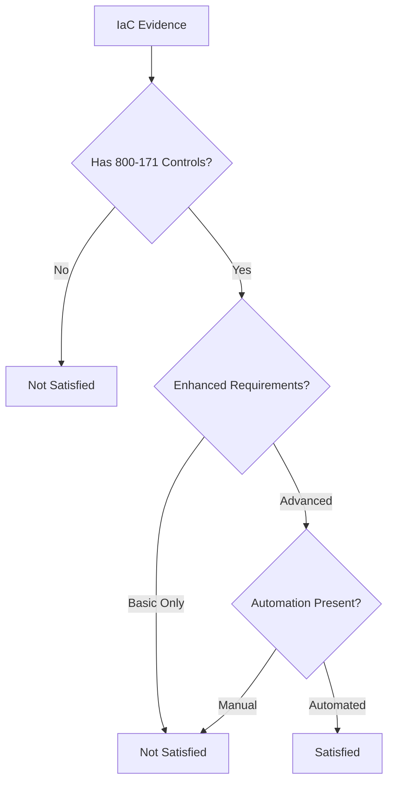

## Overview

NIST Special Publication 800-172 provides **enhanced security requirements** that supplement NIST 800-171. These controls are designed for organizations that handle high-value Controlled Unclassified Information (CUI) or operate in high-risk environments where basic security measures are insufficient.

800-172 requirements go beyond compliance checkboxesthey represent **advanced security capabilities** including behavior analytics, threat intelligence integration, and cryptographic architecture hardening.

## Framework Details

- **Framework**: NIST 800-172
- **Version**: Final Publication
- **Parent Framework**: NIST 800-171 Rev 3
- **Control Count**: 32+ enhanced requirements
- **Output Format**: OSCAL Assessment Results (JSON)
- **Primary Use Case**: High-value CUI, advanced persistent threats (APT), nation-state adversaries

## Enhanced vs. Basic Requirements

| Aspect | NIST 800-171 | NIST 800-172 |
|--------|--------------|--------------|
| **Scope** | Basic CUI protection | Enhanced CUI protection |
| **Threat Model** | Standard cyber threats | Advanced persistent threats (APT) |
| **Automation** | Recommended | Required |
| **Analytics** | Event logging | Behavior analytics, ML/AI |
| **Cryptography** | FIPS 140-2 validated | FIPS + key management architecture |
| **Access Control** | RBAC | Context-aware, adaptive access |

## Assessed Enhanced Control Families

### 3.1e - Access Control (Enhanced)

| Control | Title | Assessment Method |
|---------|-------|-------------------|
| 3.1.1e | Context-based, adaptive access controls | Detects condition-based IAM policies |
| 3.1.2e | Dual authorization for privileged commands | Organizational process (not fully assessable) |
| 3.1.3e | Monitor remote access sessions technically | Identifies CloudTrail, VPN logging |

**Example Finding:**
```json
{
  "control": "3.1.1e",
  "finding": "No dynamic access control mechanisms found",
  "evidence_gap": "IAM policies lack conditional logic for IP/time-based restrictions"
}
```

### 3.3e - Audit and Accountability (Enhanced)

| Control | Title | Assessment Method |
|---------|-------|-------------------|
| 3.3.1e | Automated audit record integration and analysis | Detects multi-layer logging (API + app + network) |
| 3.3.8e | Cryptographic protection of audit information | Verifies KMS-encrypted log groups and S3 buckets |

**Key Requirement:** Comprehensive logging across API (CloudTrail), application (CloudWatch), and network (VPC Flow Logs) layers with cryptographic integrity protection.

### 3.4e - Configuration Management (Enhanced)

| Control | Title | Assessment Method |
|---------|-------|-------------------|
| 3.4.1e | Automated detection of misconfigured components | Infrastructure-as-code represents baseline |
| 3.4.2e | Automated response to unauthorized changes | Detects AWS Config rules, Azure Policy |
| 3.4.3e | Automated access restriction enforcement | Identifies version-controlled configurations |

### 3.5e - Identification and Authentication (Enhanced)

| Control | Title | Assessment Method |
|---------|-------|-------------------|
| 3.5.1e | Multi-factor authentication for ALL access | Verifies MFA enforcement (not just privileged accounts) |
| 3.5.2e | Replay-resistant authentication mechanisms | Application-level control (not fully assessable) |
| 3.5.3e | Dynamic credential binding | Risk-based authentication (not fully assessable) |

### 3.11e - Risk Assessment (Enhanced)

| Control | Title | Assessment Method |
|---------|-------|-------------------|
| 3.11.1e | Automated threat detection and response | Detects GuardDuty, Security Hub, Sentinel |
| 3.11.2e | Predictive analytics for threat identification | Specialized platforms (not fully assessable) |
| 3.11.3e | Anomalous behavior detection | Identifies GuardDuty, behavior analytics |

**Example Evidence:**
```
"Threat intelligence integration: aws_guardduty_detector.main"
"Insider threat detection capability: aws_securityhub_account.main"
```

### 3.13e - System and Communications Protection (Enhanced)

| Control | Title | Assessment Method |
|---------|-------|-------------------|
| 3.13.1e | Cryptographic mechanisms for wireless links | Detects HTTPS/TLS listeners, API Gateway security |
| 3.13.2e | Cryptographic communications integrity | Verifies TLS policies, API key requirements |
| 3.13.6e | Physically/logically separated components | Analyzes subnet segmentation (requires 2+ subnets + ACLs) |
| 3.13.7e | Split tunneling prevention | Identifies VPN tunnel controls |
| 3.13.8e | Cryptographic protection at rest | Comprehensive encryption (S3, EBS, RDS) |

**Advanced Check - Network Segmentation:**
```python
# Requires BOTH:
# 1. Multiple subnets (2+)
# 2. Network ACLs or security groups
status = "satisfied" if (subnet_count >= 2 and has_acls) else "not-satisfied"
```

### 3.14e - System and Information Integrity (Enhanced)

| Control | Title | Assessment Method |
|---------|-------|-------------------|
| 3.14.1e | Automated response to security incidents | Detects Config remediation, Lambda automation |
| 3.14.2e | Cyber threat intelligence integration | Verifies GuardDuty, Security Hub |
| 3.14.4e | Integrity verification of software | Detects code signing (AWS Signer, signed Lambda) |
| 3.14.6e | Automated anomalous behavior detection | Identifies behavior analytics, metric filters |

## Multi-Cloud Coverage

<Note>
**Cloud-Agnostic Security Posture**: The 800-172 enhanced requirements are intentionally cloud-agnostic. While our assessor currently emphasizes AWS resources, the security principles apply universally.

**Roadmap Priorities:**
1. **AWS** (Current): GuardDuty, Security Hub, Config, Macie, Detective
2. **Azure** (Expanding): Sentinel, Defender, Policy, Security Center
3. **GCP** (Expanding): Security Command Center, Cloud Armor, Binary Authorization
4. **Kubernetes**: Falco, OPA, admission controllers, Pod Security Standards

We're actively mapping equivalent security services across cloud providers. Contact us if you need specific resource coverage.
</Note>

### Supported Resource Types by Enhanced Control

**3.1e - Adaptive Access (AWS)**
- `aws_iam_role` (with condition-based assume role policies)
- `aws_iam_policy` (with Condition blocks)

**3.3e - Advanced Logging (AWS)**
- `aws_cloudtrail`, `aws_cloudwatch_log_group`, `aws_flow_log`
- `aws_s3_bucket` (encrypted log storage)
- `aws_kms_key` (log encryption keys)

**3.4e - Automated Compliance (AWS/Azure)**
- `aws_config_configuration_recorder`, `aws_config_config_rule`, `aws_config_remediation_configuration`
- `azurerm_policy_definition`, `azurerm_policy_assignment`

**3.11e - Threat Intelligence (AWS/Azure)**
- `aws_guardduty_detector`, `aws_securityhub_account`, `aws_securityhub_standards_subscription`
- `azurerm_security_center_subscription_pricing`

**3.13e - Advanced Crypto (AWS/Azure/GCP)**
- `aws_kms_key`, `aws_ebs_encryption_by_default`, `aws_s3_bucket_server_side_encryption_configuration`
- `azurerm_key_vault`, `azurerm_key_vault_key`
- `google_kms_crypto_key`, `google_kms_key_ring`

**3.14e - Security Automation (AWS)**
- `aws_lambda_function` (security automation functions)
- `aws_signer_signing_profile`, `aws_lambda_function` (with code signing)
- `aws_cloudwatch_log_metric_filter` (behavior monitoring)

## Assessment Workflow



## OSCAL Output Structure

Enhanced controls include additional properties to distinguish from basic requirements:

```json
{
  "observation": {
    "uuid": "obs-uuid",
    "title": "3.1.1e Evidence",
    "description": "Dynamic access control policy: aws_iam_role.admin",
    "props": [
      { "name": "control-id", "value": "3.1.1e" },
      { "name": "enhancement-level", "value": "advanced" },
      { "name": "automated", "value": "true" },
      { "name": "parent-control", "value": "3.1.1" },
      { "name": "framework", "value": "NIST-800-172" }
    ]
  }
}
```

## Example Assessment Request

```bash
curl --request POST \
  --url https://api.usenabla.com/v1/cmmc \
  --header 'Content-Type: application/json' \
  --header 'X-Customer-Key: <x-customer-key>' \
  --data '{
  "name": "<string>",
  "format": "oscal",
  "source_type": "terraform_state",
  "source_content": "<string>",
}'
```

Set `include_parent_framework: true` to get both 800-171 and 800-172 assessments in a single request.

## Common Enhanced Control Gaps

### Critical Deficiencies

**3.3.1e - Insufficient Logging Coverage**
```
Finding: "Comprehensive system-wide audit logging not found (need API, application, and network logging)"
Current: CloudTrail only
Required: CloudTrail + CloudWatch + VPC Flow Logs
```

**3.5.1e - MFA Not Universally Enforced**
```
Finding: "No multi-factor authentication enforcement found"
Current: MFA optional for users
Required: MFA required for ALL access (not just privileged)
```

**3.11.1e - No Automated Threat Detection**
```
Finding: "No continuous monitoring capabilities found"
Current: Manual log review
Required: GuardDuty or equivalent automated threat detection
```

### Common Misconfigurations

**3.13.6e - Inadequate Network Segmentation**
```
Finding: "Insufficient network segmentation (need multiple subnets with ACLs/security groups)"
Current: Single subnet or no ACLs
Required: 2+ subnets with NACLs/security groups
```

**3.14.1e - Manual Incident Response**
```
Finding: "No automated security response mechanisms found"
Current: Manual runbooks
Required: AWS Config auto-remediation or Lambda automation
```

## Who Needs NIST 800-172?

### Required For
- Organizations handling **high-value CUI** (e.g., advanced weapons systems, intelligence)
- Defense Industrial Base (DIB) companies with APT threat profiles
- Critical infrastructure providers under CISA guidelines
- Research institutions with classified/CUI data collaboration

### Not Required For
- Standard government contractors with basic CUI (800-171 sufficient)
- Commercial SaaS companies (unless handling CUI)
- Organizations without nation-state threat models

## Compliance Strategy

### Phased Implementation

**Phase 1: Foundation (NIST 800-171)**
1. Implement basic security controls
2. Achieve 110/110 on 800-171 assessment
3. Document SSP and POA&M

**Phase 2: Enhancement (NIST 800-172)**
1. Add automated threat detection (GuardDuty, Sentinel)
2. Implement behavior analytics
3. Enhance cryptographic architecture
4. Deploy security orchestration (SOAR)

**Phase 3: Continuous Assurance**
1. Automated compliance scanning (daily)
2. Integration with CI/CD pipelines
3. Real-time OSCAL reporting
4. Third-party validation

## Limitations

<Warning>
**Enhanced Control Assessment Limitations**:
- **Behavioral Controls**: Many 800-172 controls require runtime behavior analysis, not just configuration
- **Threat Intelligence**: Integration with threat feeds cannot be fully validated from IaC
- **Organizational Maturity**: Controls like dual authorization (3.1.2e) require process validation
- **Predictive Analytics**: ML/AI-based threat detection (3.11.2e) requires specialized platforms
- **IaC Scope**: Only infrastructure resources are assessedapplication security is out of scope
</Warning>

## Best Practices

1. **Layered Defense**: 800-172 assumes 800-171 compliancedon't skip the basics
2. **Automation First**: Manual processes do not satisfy enhanced requirements
3. **Evidence Collection**: Retain logs, scan results, and OSCAL outputs for audits
4. **Continuous Assessment**: Enhanced controls require continuous monitoring, not point-in-time audits
5. **Threat Modeling**: Align security investments with your organization's threat profile

## Relationship to Other Frameworks

| Framework | Relationship to 800-172 |
|-----------|-------------------------|
| **NIST 800-171** | Parent frameworkbasic requirements |
| **NIST 800-53** | Source catalog for many enhanced controls |
| **CMMC 2.0 Level 3** | Incorporates 800-172 requirements |
| **FIPS 140-3** | Cryptographic validation referenced by 3.13e controls |
| **Zero Trust** | Architectural alignment with adaptive access (3.1e) |

## Cost Considerations

Implementing 800-172 enhanced controls typically requires:
- **AWS**: GuardDuty ($4-8/account/month), Security Hub ($0.001/finding), Config ($2-5/rule/month)
- **Azure**: Sentinel ($2-5/GB ingested), Defender ($15/server/month)
- **GCP**: Security Command Center Premium ($25-100/project/month)
- **Third-Party**: SIEM, SOAR, threat intel subscriptions ($10K-100K+/year)

Budget 15-30% above baseline 800-171 costs for enhanced security capabilities.

## Related Resources

- [NIST 800-171](/api-reference/schemas/800-171) - Basic CUI protection requirements
- [NIST 800-53](/api-reference/schemas/800-53) - Security controls catalog
- [FIPS 140-3](/api-reference/schemas/fips-140-3) - Cryptographic module validation
- [CMMC 2.0 Level 3](/api-reference/schemas/cmmc) - Advanced cybersecurity practices

## Official References

- [NIST SP 800-172 (Official Publication)](https://csrc.nist.gov/publications/detail/sp/800-172/final)
- [NIST SP 800-171 Rev 3](https://csrc.nist.gov/publications/detail/sp/800-171/rev-3/final)
- [DoD CUI Program](https://www.dodcui.mil/)
- [CISA Enhanced Security Requirements](https://www.cisa.gov/enhanced-security-requirements)
