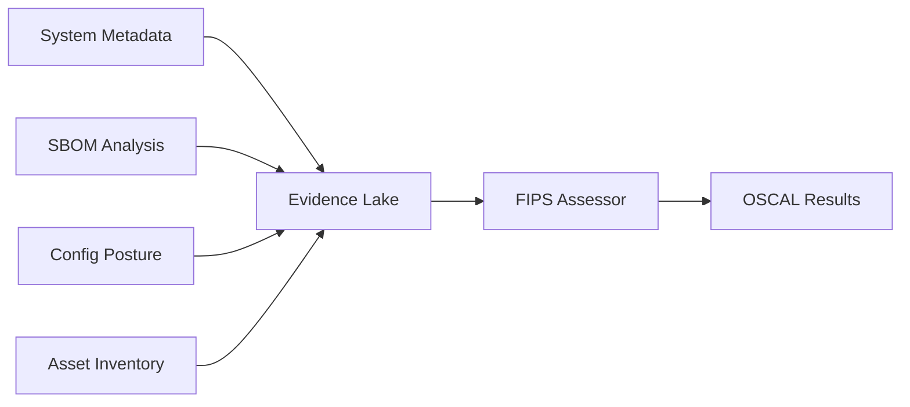

## Overview

Federal Information Processing Standard (FIPS) 140-3 specifies security requirements for cryptographic modules used by federal agencies and their contractors. Compliance with FIPS 140-3 is mandatory for systems that process sensitive but unclassified (SBU) information or Controlled Unclassified Information (CUI).

Nabla's FIPS assessment evaluates whether your infrastructure uses **FIPS-validated cryptographic implementations** and follows cryptographic best practices across encryption at rest, encryption in transit, and key management.

## Framework Details

- **Framework**: FIPS 140-3
- **Standard Type**: Cryptographic module validation
- **Validation Authority**: NIST Cryptographic Module Validation Program (CMVP)
- **Output Format**: OSCAL Assessment Results (JSON)
- **Primary Use Case**: Federal systems, FISMA compliance, CUI protection

## Key Concepts

### FIPS 140-3 Security Levels

| Level | Description | Use Case |
|-------|-------------|----------|
| **Level 1** | Basic security requirements | Software encryption, low-risk environments |
| **Level 2** | Tamper-evidence, role-based authentication | Most federal systems, cloud HSMs |
| **Level 3** | Tamper-resistant, identity-based authentication | High-security applications |
| **Level 4** | Tamper-detection with active response | Top Secret environments, nuclear systems |

**Note**: Most cloud provider KMS services (AWS KMS, Azure Key Vault, GCP Cloud KMS) are validated at **FIPS 140-2 Level 2** or **FIPS 140-3 Level 1-2**. Check the [CMVP validation list](https://csrc.nist.gov/projects/cryptographic-module-validation-program/validated-modules) for specific certificates.

### FIPS Mode vs. FIPS Validation

| Aspect | FIPS Mode | FIPS Validation |
|--------|-----------|-----------------|
| **Definition** | Operating system/library configuration | CMVP-tested cryptographic module |
| **Evidence** | OS settings, library version | CMVP certificate number |
| **Compliance** | Necessary but insufficient | Required for full compliance |
| **Example** | OpenSSL FIPS mode enabled | AWS KMS (FIPS 140-2 Cert #3139) |

**Critical Distinction**: Using a FIPS-validated library in non-FIPS mode does NOT constitute compliance. Both validation AND proper configuration are required.

## Assessed Cryptographic Controls

Nabla's FIPS assessor maps evidence to FedRAMP cryptographic controls from NIST 800-53 Rev 5:

### SC-13: Cryptographic Protection

**Requirement**: Implement FIPS-validated cryptography to protect information

**Assessment Criteria**:
- System metadata indicates FIPS mode enabled (`fips_mode_enabled: true`)
- SBOM identifies FIPS-validated cryptographic libraries
- CMVP certificate numbers are documented
- No weak cryptographic algorithms detected (MD5, SHA-1, DES, 3DES, RC4)

**Evidence Sources**:
```rust
// System Metadata
fips_mode_enabled: true
openssl_fips_status: "OpenSSL 3.0.8-fips"

// SBOM Evidence
cryptographic_libraries: ["openssl", "libgcrypt"]
fips_validated: true
fips_certificate_number: "4282"

// Configuration Posture
weak_crypto_detected: false
encryption_algorithm: "AES-256-GCM"
```

**Example Finding**:
```json
{
  "control": "SC-13",
  "status": "not-satisfied",
  "findings": [
    "Non-FIPS-validated library in use: BoringSSL v1.1.1",
    "Weak cryptography detected in nginx.conf: TLSv1.0, SSLv3"
  ],
  "evidence": [
    "FIPS mode enabled on system: ip-10-0-1-42",
    "FIPS-validated library: OpenSSL v3.0.8 (CMVP Certificate #4282)"
  ]
}
```

### SC-12: Cryptographic Key Establishment and Management

**Requirement**: Establish and manage cryptographic keys for employed cryptography

**Assessment Criteria**:
- Key Management Service (KMS) resources detected
- Customer Master Keys (CMK) properly configured
- Key rotation enabled
- Key metadata includes spec, usage, origin
- Key size meets minimums (e2048 bits for RSA, e256 bits for AES)

**Evidence Sources**:
```rust
// Asset Inventory
asset_type: "key_vault"
properties: {
  customer_master_key_spec: "RSA_4096",
  key_usage: "ENCRYPT_DECRYPT",
  key_id: "arn:aws:kms:us-east-1:123456789012:key/abc-123",
  origin: "AWS_KMS",
  enable_key_rotation: true
}

// Configuration Posture
cryptographic_material_type: "symmetric_key"
key_size: 4096
```

**Example Finding**:
```json
{
  "control": "SC-12",
  "status": "not-satisfied",
  "findings": [
    "Key management system: vault-prod (incomplete metadata - missing key policy or configuration details) [provider=hashicorp]",
    "Weak key size detected in tls.conf: 1024 bits"
  ],
  "evidence": [
    "Key management system: aws-kms-primary (RSA_4096), spec=RSA_4096, usage=ENCRYPT_DECRYPT, keyId=abc-123, origin=AWS_KMS, rotation=enabled [provider=aws]"
  ]
}
```

### SC-17: Public Key Infrastructure Certificates

**Requirement**: Issue public key certificates under an approved certificate policy

**Assessment Criteria**:
- Valid X.509 certificates detected on assets
- Certificate signature algorithms meet standards (SHA-256+)
- Certificate key sizes e2048 bits
- No expired or self-signed certificates (in production)

**Evidence Sources**:
```rust
// Certificate Info
certificate_info: {
  subject: "CN=api.example.com",
  issuer: "CN=DigiCert TLS RSA SHA256 2020 CA1",
  signature_algorithm: "SHA256-RSA",
  key_size: 2048,
  valid_from: "2024-01-01T00:00:00Z",
  valid_to: "2025-01-01T00:00:00Z"
}
```

**Example Finding**:
```json
{
  "control": "SC-17",
  "status": "not-satisfied",
  "findings": [
    "Weak signature algorithm in certificate: SHA1-RSA (load-balancer-prod)",
    "Weak certificate key size: 1024 bits (legacy-api)"
  ],
  "evidence": [
    "Certificate found on api-gateway-prod: subject=CN=api.example.com, issuer=CN=DigiCert",
    "Certificate signature algorithm: SHA256-RSA"
  ]
}
```

### SC-28: Protection of Information at Rest

**Requirement**: Protect confidentiality and integrity of information at rest

**Assessment Criteria**:
- Storage and database assets have `encryption_at_rest: true`
- KMS key ID is documented for encrypted resources
- Encryption algorithm specified (AES-256-GCM preferred)

**Evidence Sources**:
```rust
// Asset Inventory
asset_type: "database"
encryption_at_rest: true
kms_key_id: "arn:aws:kms:us-east-1:123456789012:key/xyz-789"
properties: {
  encryption_algorithm: "AES-256-GCM"
}
```

**Example Finding**:
```json
{
  "control": "SC-28",
  "status": "satisfied",
  "evidence": [
    "Encryption at rest enabled: s3-data-lake (storage), KMS key: xyz-789, algorithm: AES-256-GCM",
    "Encryption at rest enabled: postgres-primary (database), KMS key: xyz-789"
  ]
}
```

### SC-8: Transmission Confidentiality and Integrity

**Requirement**: Protect confidentiality and integrity of transmitted information

**Assessment Criteria**:
- Assets have `encryption_in_transit: true`
- TLS version e1.2 (prefer TLS 1.3)
- Modern cipher suites configured
- No SSLv2, SSLv3, TLSv1.0, TLSv1.1

**Evidence Sources**:
```rust
// Asset Inventory
encryption_in_transit: true
tls_version: "TLSv1.3"

// Configuration Posture
cipher_suite: "ECDHE-RSA-AES256-GCM-SHA384"
```

**Example Finding**:
```json
{
  "control": "SC-8",
  "status": "not-satisfied",
  "findings": [
    "Weak TLS version in use: TLSv1.0 (load-balancer-legacy)"
  ],
  "evidence": [
    "Encryption in transit enabled: api-gateway",
    "TLS version: TLSv1.3 (load-balancer-prod)",
    "Cipher suite configured: ECDHE-RSA-AES256-GCM-SHA384 (nginx.conf)"
  ]
}
```

## Multi-Cloud FIPS Validation

<Note>
**Cloud Provider FIPS Status**: Major cloud providers maintain CMVP-validated cryptographic modules, but validation status varies by service and region.

**Current Coverage (Expanding)**:
- **AWS**: KMS, CloudHSM, S3, RDS, EBS (see [AWS FIPS endpoints](https://aws.amazon.com/compliance/fips/))
- **Azure**: Key Vault, Storage, SQL Database (see [Azure FIPS 140 validation](https://docs.microsoft.com/en-us/azure/compliance/offerings/offering-fips-140-2))
- **Google Cloud**: Cloud KMS, Cloud HSM (see [GCP FIPS 140-2 compliance](https://cloud.google.com/security/compliance/fips-140-2-validated))

**Important**: Always verify current validation status on the [NIST CMVP website](https://csrc.nist.gov/projects/cryptographic-module-validation-program/validated-modules). Validations can expire or be updated.
</Note>

### CMVP Certificate Tracking

Nabla automatically extracts CMVP certificate numbers from SBOM metadata:

```json
{
  "observation": {
    "description": "FIPS-validated library: OpenSSL v3.0.8 (CMVP Certificate #4282)",
    "props": [
      {
        "name": "cmvp-cert-number",
        "value": "4282",
        "ns": "https://www.usenabla.com/ns/oscal"
      }
    ]
  }
}
```

**Validation Lookup**: [https://csrc.nist.gov/projects/cryptographic-module-validation-program/certificate/4282](https://csrc.nist.gov/projects/cryptographic-module-validation-program/certificate/4282)

## Evidence Lake Integration

The FIPS assessor consumes evidence from Nabla's multi-source evidence lake:



### Evidence Sources

**1. System Metadata** (`system_metadata`)
- `fips_mode_enabled`: Boolean indicating OS-level FIPS mode
- `openssl_fips_status`: OpenSSL FIPS configuration string
- `hostname`: System identifier for evidence attribution

**2. Software Bill of Materials** (`sboms`)
- `component_name`, `component_version`: Software identity
- `cryptographic_libraries`: Array of crypto libs (e.g., `["openssl", "libgcrypt"]`)
- `fips_validated`: Boolean attestation
- `fips_certificate_number`: CMVP cert number (e.g., `"4282"`)

**3. Configuration Posture** (`configs_posture`)
- `weak_crypto_detected`: Boolean flag for legacy algorithms
- `encryption_algorithm`: Configured algorithm (e.g., `"AES-256-GCM"`)
- `cipher_suite`: TLS cipher suite
- `key_size`: Cryptographic key size in bits
- `cryptographic_material_type`: Type of crypto material (`private_key`, `symmetric_key`, `certificate`)

**4. Asset Inventory** (`asset_inventory`)
- `asset_type`: Infrastructure type (`storage`, `database`, `key_vault`)
- `encryption_at_rest`, `encryption_in_transit`: Boolean flags
- `kms_key_id`: KMS key ARN/ID
- `tls_version`: TLS protocol version
- `certificate_info`: X.509 certificate metadata
- `provider`: Cloud provider (`aws`, `azure`, `gcp`)

## OSCAL Output Structure

FIPS assessment results include detailed subject tracking and observation linking:

```json
{
  "assessment-results": {
    "results": [{
      "uuid": "result-uuid",
      "title": "FedRAMP FIPS Cryptographic Assessment",
      "local-definitions": {
        "components": [
          {
            "uuid": "component-uuid",
            "type": "software",
            "title": "OpenSSL Cryptographic Library",
            "description": "FIPS-validated library: OpenSSL v3.0.8 (CMVP Certificate #4282)",
            "props": [
              { "name": "asset-type", "value": "cryptographic-module" }
            ]
          }
        ],
        "inventory-items": [
          {
            "uuid": "inventory-uuid",
            "description": "Asset: data-lake",
            "props": [
              { "name": "asset-type", "value": "infrastructure" }
            ]
          }
        ]
      },
      "observations": [
        {
          "uuid": "obs-uuid",
          "title": "SC-13 Evidence",
          "description": "FIPS-validated library: OpenSSL v3.0.8 (CMVP Certificate #4282)",
          "methods": ["TEST", "AUTOMATED"],
          "subjects": [
            { "subject-id": "component-uuid", "type": "component" }
          ],
          "props": [
            { "name": "control-id", "value": "SC-13" },
            { "name": "status", "value": "satisfied" },
            { "name": "cmvp-cert-number", "value": "4282" },
            { "name": "assessment-type", "value": "fips-cryptographic" }
          ]
        }
      ],
      "findings": [
        {
          "uuid": "finding-uuid",
          "title": "SC-13 Finding",
          "description": "Weak cryptography detected in nginx.conf: TLSv1.0, SSLv3",
          "target": { "target-id": "SC-13", "type": "control" },
          "related-observations": [
            { "observation-uuid": "obs-uuid" }
          ]
        }
      ]
    }]
  }
}
```

## Example Assessment Request

```bash
    curl --request POST \
    --url https://api.usenabla.com/v1/fips \
    --header 'Content-Type: application/json' \
    --header 'X-Customer-Key: <x-customer-key>' \
    --data '{
    "name": "<string>",
    "format": "oscal",
    "zip_content": "<string>"
    }'
```

## Common FIPS Compliance Issues

### Critical Violations

**Non-FIPS Cryptographic Libraries**
```
Finding: "Non-FIPS-validated library in use: BoringSSL v1.1.1"
Impact: Federal systems cannot use non-validated crypto
Remediation: Replace with OpenSSL FIPS module or AWS-LC-FIPS
```

**Weak Cryptographic Algorithms**
```
Finding: "Weak cryptography detected: MD5, SHA-1, DES"
Impact: Prohibited algorithms under FIPS 140-3
Remediation: Migrate to SHA-256+, AES-256, or approved algorithms
```

**FIPS Mode Not Enabled**
```
Finding: "FIPS mode NOT enabled on system: production-app-01"
Impact: Validated library used incorrectly (non-compliant)
Remediation: Enable FIPS mode in kernel/OS configuration
```

### Warnings

**Missing CMVP Certificate**
```
Finding: "OpenSSL present; FIPS validation/mode not attested (v3.0.8 build string)"
Impact: Cannot verify CMVP validation
Remediation: Document CMVP certificate number in SBOM metadata
```

**Incomplete KMS Metadata**
```
Finding: "Key management system: vault-prod (incomplete metadata - missing key policy)"
Impact: Cannot assess key management compliance
Remediation: Provide key spec, usage, rotation settings
```

## FIPS-Approved Algorithms (FIPS 140-3)

### Encryption

| Algorithm | Key Size | Status | Use Case |
|-----------|----------|--------|----------|
| **AES** | 128, 192, 256 bits |  Approved | Symmetric encryption |
| **Triple-DES** | 168 bits (112 effective) | � Legacy (disallowed after 2023) | Migration only |
| **RSA** | e2048 bits |  Approved | Asymmetric encryption |
| **ECC** | e256 bits (P-256, P-384, P-521) |  Approved | Asymmetric encryption |

### Hashing

| Algorithm | Output Size | Status | Use Case |
|-----------|-------------|--------|----------|
| **SHA-2** | 224, 256, 384, 512 bits |  Approved | Digital signatures, HMAC |
| **SHA-3** | 224, 256, 384, 512 bits |  Approved | Next-gen hashing |
| **SHA-1** | 160 bits | L Disallowed | Legacy only (signatures prohibited) |
| **MD5** | 128 bits | L Disallowed | Non-cryptographic use only |

### Key Agreement

| Protocol | Status | Use Case |
|----------|--------|----------|
| **ECDH** (P-256, P-384, P-521) |  Approved | Elliptic curve key exchange |
| **DH** (e2048 bits) |  Approved | Diffie-Hellman key exchange |

## Federal Compliance Context

### FISMA Requirements

**FIPS 140-3 Mandate**: FISMA (Federal Information Security Management Act) requires all federal information systems to use FIPS-validated cryptography.

**OMB Circular A-130**: Federal agencies must implement FIPS 140-3 validated cryptographic modules for:
- Confidentiality protection
- Integrity verification
- Authentication
- Nonrepudiation

### NIST Guidelines

- **NIST SP 800-52 Rev 2**: TLS implementation guidance
- **NIST SP 800-57**: Key management recommendations
- **NIST SP 800-175B**: Algorithm security lifetimes

## Limitations

<Warning>
**FIPS Assessment Limitations**:
- **IaC Scope**: Only evaluates infrastructure declared in code/evidence lake
- **CMVP Trust**: Relies on SBOM attestations; does not independently verify CMVP certificates
- **Runtime Validation**: Cannot verify FIPS mode is enabled at runtime (only config)
- **Application Crypto**: Cannot assess application-level cryptographic implementations
- **Hardware Modules**: Physical HSMs (FIPS 140-3 Level 3/4) require on-site validation
</Warning>

## Best Practices

1. **Use Cloud Provider KMS**: AWS KMS, Azure Key Vault, GCP Cloud KMS are FIPS-validated
2. **Enable FIPS Mode**: Configure OS and libraries for FIPS operation
3. **Document CMVP Certificates**: Include certificate numbers in SBOM metadata
4. **Rotate Keys**: Enable automatic key rotation (annually minimum)
5. **Audit Cryptographic Inventory**: Maintain up-to-date SBOM with crypto libraries
6. **Test FIPS Endpoints**: Use FIPS-specific API endpoints (e.g., `kms-fips.us-east-1.amazonaws.com`)

**Migration Note**: FIPS 140-2 validations remain acceptable until September 2026. After this date, only FIPS 140-3 validated modules will be compliant.

## Related Frameworks

- [NIST 800-53](/api-reference/schemas/800-53) - Security controls including SC-13, SC-12, SC-8
- [NIST 800-171](/api-reference/schemas/800-171) - Requirement 3.13.11 (FIPS-validated cryptography)
- [NIST 800-172](/api-reference/schemas/800-172) - Enhanced cryptographic requirements
- [FedRAMP](/api-reference/schemas/fedramp) - Cryptographic requirements for cloud services

## References

- [FIPS 140-3 Standard (Official)](https://csrc.nist.gov/publications/detail/fips/140/3/final)
- [CMVP Validated Modules](https://csrc.nist.gov/projects/cryptographic-module-validation-program/validated-modules)
- [Azure FIPS 140 Validation](https://docs.microsoft.com/en-us/azure/compliance/offerings/offering-fips-140-2)
- [NIST SP 800-52 Rev 2 (TLS Guidelines)](https://csrc.nist.gov/publications/detail/sp/800-52/rev-2/final)
